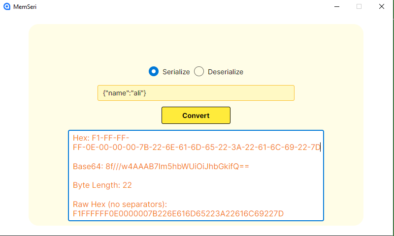

# MemSeri Project

Welcome to the **MemSeri(MemoryPack)** project! This application is designed to help you easily serialize and deserialize JSON data with a clean and user-friendly interface.

## Features

- Serialize objects into JSON format.
- Deserialize JSON data back into objects.
- Simple UI with clear controls.
- Supports switching between serialize and deserialize modes.
- Responsive design with hover and focus effects.

## Screenshot

Here is a screenshot of the application interface:

## Getting Started

1. Clone this repository.
2. Open the project in your preferred IDE.
3. Build and run the application.
4. Use the radio buttons to switch between Serialize and Deserialize modes.
5. Enter your data and click Convert to see the results.

## Technologies Used

- Avalonia UI
- C#
- .NET Core

## Contribution

Feel free to fork the repository and submit pull requests. For major changes, please open an issue first to discuss what you would like to change.

---

Thank you for checking out the MemSeri project!
